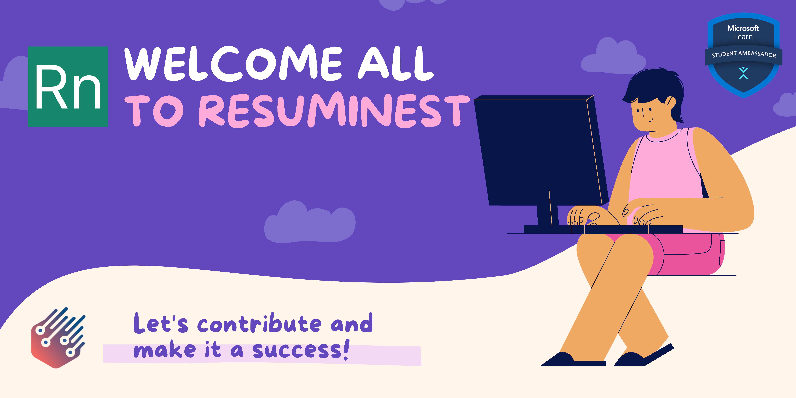
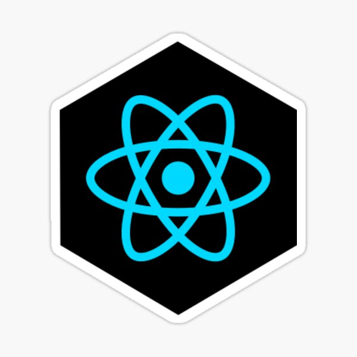
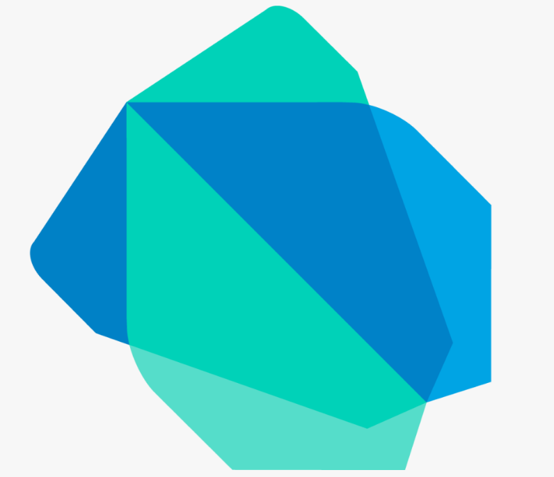
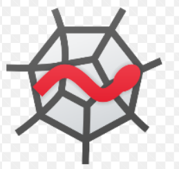
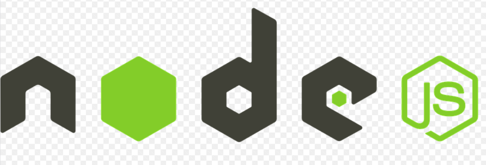

<html>
  <head>
  <meta charset="UTF-8">
  </head>
<body>

<h2>✨Introduction</h2>

  
<b><i>"If opportunity doesn't knock, build a door."</b> ― Milton Berle</i>

A resume is an important tool for your job search because it offers a page where you can display your top skills and
qualities. It help employers make hiring decisions and help you get your dream job.
  

  
  <h2>📄 About</h2>
  
Resumenest is basically a resume building web and android application with added machine learning features. The front end of the application includes a login/signup page via which a new user creates an account or an old user logs into their account.During resume creation the application fetches data from the user using multi forms and the data is added to the user selected template and resume is created. We have then implemented a classification ML-algorithm to classify the best suited job role  based on skill sets and various data from the input resume.
  

  <h2>💻Software</h2>
     

  <h3><b>  FRONT-END: </b></h3>
  

<ul> <b>Web Technology:<b>       </ul>
  
  <ul><b>Languages Used:</b>       </ul>
  <ul><b> Development Tool:</b>     </ul>

   
  <h3><b>  BACK-END: </b></h3>
  

  <ul><b>Database: </b>    </ul>

  
  <h2>🏆 Our Army</h2>
<!--     <table>
    <tr>
      <td> MENTORS</td>
    <td> Ankita Bera (1828229)</td>
      <td>Santanu Biswas (1904465)</td>
    </tr>
       <tr>
         <td>TEAM MEMBERS</td>
    <td>Ayan Chakraborty (1905741))</td>
         <td>Soumayan Pal (1929121))</td>
    <tr><td>      </td>
<td>Eshaan Anand (2005451))</td>
<td>Santanu Biswas (1904465))</td>
    </tr>
    <tr>
      <td>LEARNERS</td>
      <td>Akriti Choudhary(2005776)</td>
      <td>Priyanka Sengupta(20051556)</td>
    </tr>
    </table> -->
  
   <table style="width:100%">
  <tr>
    <th>Mentors</th>
    <th>Team members</th>
    <th>Learners</th>
  </tr>
  <tr>
    <td>Ankita Bera</td>
    <td>Ayan Chakraborty</td>
    <td>Priyanka Sengupta</td>
  </tr>
  <tr>
    <td>Shantanu Biswas</td>
    <td>Soumayan Pal</td>
    <td>Akriti Choudhary</td>
  </tr>
   <tr>
    <td> </td>
    <td>Eshaan Anand</td>
    <td> </td>
  </tr>
     <tr>
    <td> </td>
    <td>Sriniketh</td>
    <td> </td>
  </tr>
  </body>